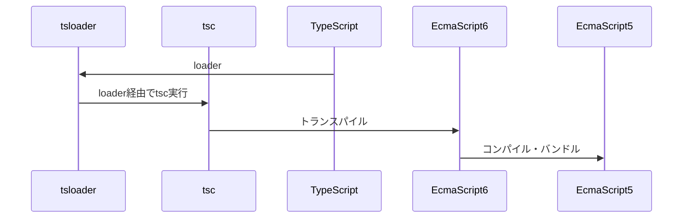

## 概要

このリポジトリは下記の環境で開発するためのテンプレートです

- React v18
- webpack5
- TypeScript

## ローカル

[webpack-dev-server](https://webpack.js.org/configuration/dev-server/#root)を使用

```
$ yarn install

$ yarn run start
```

## ビルドの流れ



## 参考

https://reactjs.org/blog/2022/03/08/react-18-upgrade-guide.html#updates-to-client-rendering-apis

https://webpack.js.org/concepts/
